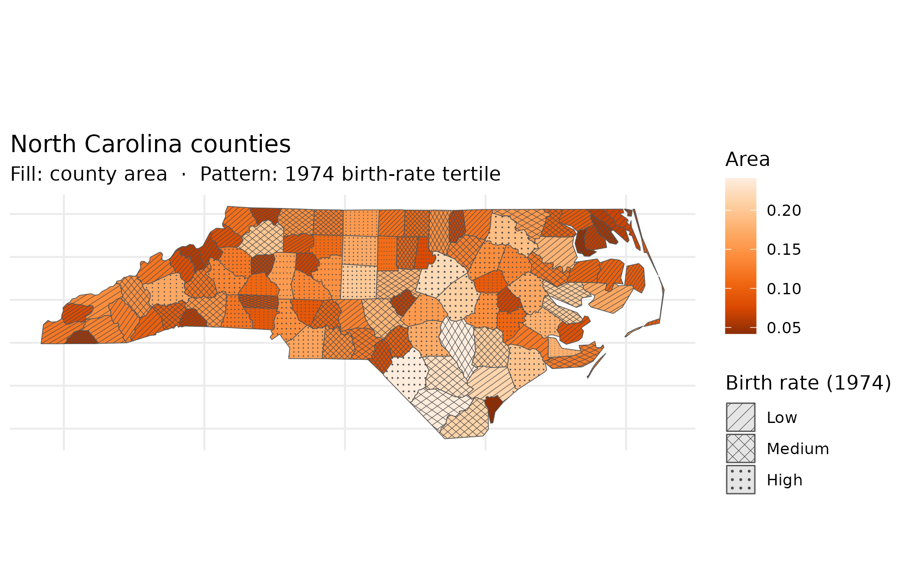
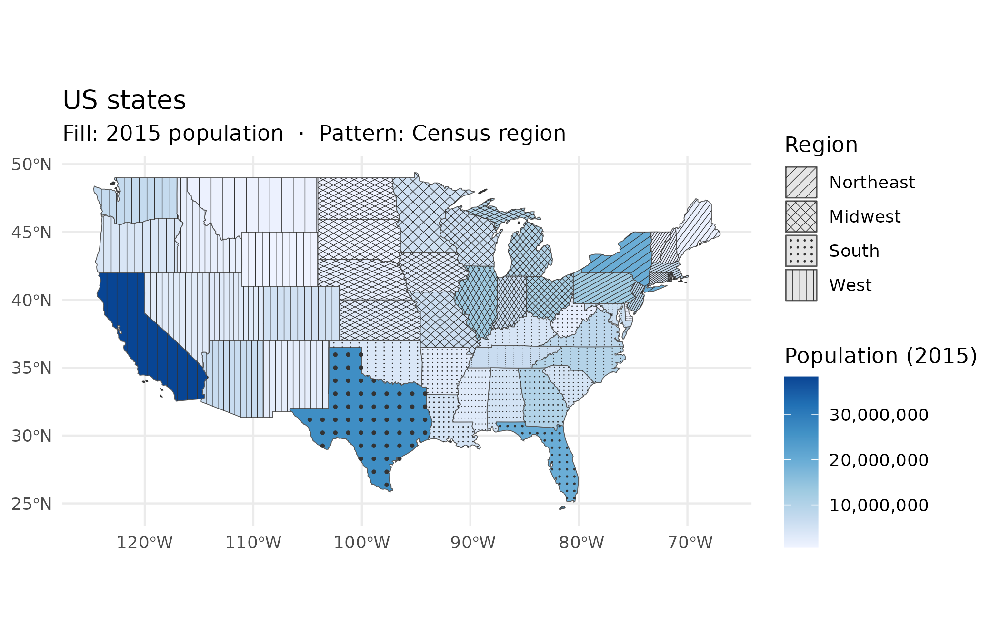

# Mapping with Patterns

Pattern fill overlays give choropleth maps a second encoding channel
that works independently of colour. The result reads correctly in
grayscale, in PDF, and for readers with colour-vision deficiency — three
contexts where a colour-only map fails.

## North Carolina counties

The North Carolina county dataset bundled with the **sf** package lets
us encode two census variables simultaneously: county area (`AREA`,
continuous) mapped to fill colour, and 1974 birth-rate tertile (`BIR74`,
cut into three equal-count bins) mapped to pattern. Readers can see both
dimensions at once — the pattern distinguishes high-birth-rate counties
regardless of whether they also happen to be large or small.

``` r

library(ggplot2)
library(sf)
#> Linking to GEOS 3.12.1, GDAL 3.8.4, PROJ 9.4.0; sf_use_s2() is TRUE
library(ggpatchy)

nc <- st_read(system.file("shape/nc.shp", package = "sf"), quiet = TRUE)

# Quantile-based tertiles give balanced bin sizes across skewed BIR74 data
nc$birth_bin <- cut(
  nc$BIR74,
  breaks        = quantile(nc$BIR74, probs = c(0, 1/3, 2/3, 1)),
  include.lowest = TRUE,
  labels        = c("Low", "Medium", "High")
)

ggplot(nc) +
  geom_sf_pattern(
    aes(fill = AREA, pattern = birth_bin),
    pattern_colour    = "grey30",
    pattern_linewidth = 0.4,
    pattern_spacing   = 0.12
  ) +
  scale_pattern_manual(
    values = c(Low = "hatch", Medium = "crosshatch", High = "dots"),
    name   = "Birth rate (1974)"
  ) +
  scale_fill_distiller(palette = "Oranges", name = "Area") +
  labs(
    title    = "North Carolina counties",
    subtitle = "Fill: county area  ·  Pattern: 1974 birth-rate tertile"
  ) +
  theme_minimal() +
  theme(axis.text = element_blank())
```



## US states

The **spData** package’s `us_states` dataset maps 2015 population
(`total_pop_15`) to fill colour and US Census region to pattern. Four
patterns — one per region — distinguish Midwest, Northeast, South, and
West without adding a second colour scale. The combination lets readers
ask two questions at once: *how populous is this state?* (colour) and
*which region is it in?* (pattern). Both questions are answerable from a
black-and-white printout.

``` r

library(spData)
#> To access larger datasets in this package, install the spDataLarge
#> package with: `install.packages('spDataLarge',
#> repos='https://nowosad.github.io/drat/', type='source')`

# Fix a known typo in the REGION factor level
us <- us_states
levels(us$REGION)[levels(us$REGION) == "Norteast"] <- "Northeast"

ggplot(us) +
  geom_sf_pattern(
    aes(fill = total_pop_15, pattern = REGION),
    pattern_colour    = "grey20",
    pattern_linewidth = 0.45,
    pattern_spacing   = 0.09
  ) +
  scale_pattern_manual(
    values = c(
      Midwest   = "hatch",
      Northeast = "crosshatch",
      South     = "dots",
      West      = "vertical"
    ),
    name = "Region"
  ) +
  scale_fill_distiller(
    palette   = "Blues",
    direction = 1,
    name      = "Population (2015)",
    labels    = scales::comma
  ) +
  labs(
    title    = "US states",
    subtitle = "Fill: 2015 population  ·  Pattern: Census region"
  ) +
  theme_minimal()
```


