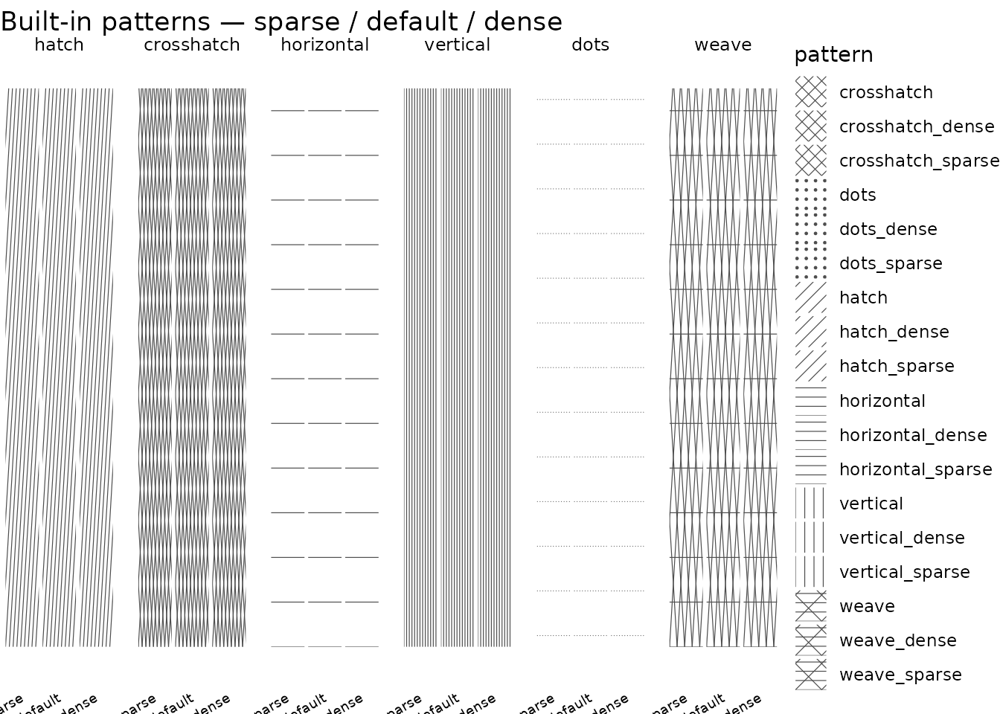

# Pattern reference

Every built-in pattern ships in three density variants.
`pattern_spacing` can still be set explicitly to tune further from any
starting point.

``` r

library(ggplot2)
library(ggpatchy)

bases <- c("hatch", "crosshatch", "horizontal", "vertical", "dots", "weave")

df <- data.frame(
  base    = rep(bases, each = 3),
  density = rep(c("sparse", "default", "dense"), times = length(bases)),
  pattern = c(rbind(
    paste0(bases, "_sparse"),
    bases,
    paste0(bases, "_dense")
  )),
  value   = 1
)
df$base    <- factor(df$base,    levels = bases)
df$density <- factor(df$density, levels = c("sparse", "default", "dense"))

ggplot(df, aes(density, value, pattern = pattern)) +
  geom_col_pattern(
    fill              = "white",
    pattern_colour    = "grey30",
    pattern_linewidth = 0.6,
    width             = 0.9
  ) +
  scale_pattern_identity() +
  facet_wrap(~base, ncol = length(bases)) +
  theme_void() +
  theme(
    strip.text   = element_text(size = 9, margin = margin(b = 4)),
    axis.text.x  = element_text(size = 7, angle = 30, hjust = 1,
                                 margin = margin(t = 2)),
    panel.spacing = unit(0.5, "lines")
  ) +
  labs(title = "Built-in patterns — sparse / default / dense")
```


